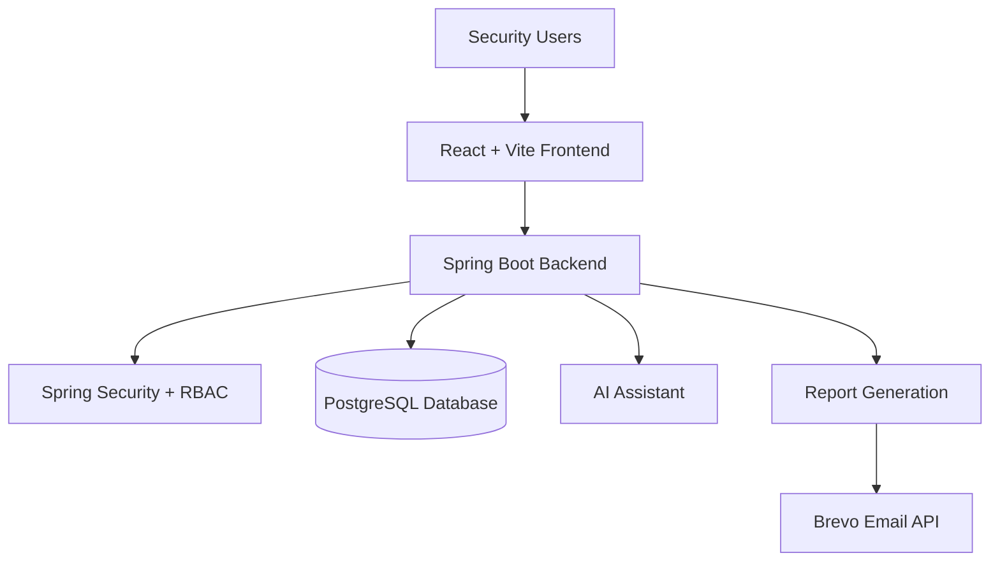

# SentinelCore-SecureOps

## Enterprise Security Operations & Threat Management Platform

[](https://spring.io/projects/spring-boot)
[](https://openjdk.org/)
[](https://react.dev/)
[](https://vitejs.dev/)
[](https://www.postgresql.org/)
[](https://www.docker.com/)
[](https://render.com/)
[](https://www.brevo.com/)

SentinelCore-SecureOps is a unified Security Operations Center platform designed to help organizations monitor assets, manage security incidents, track vulnerabilities, assess compliance, generate reports, and interact with an AI-powered security assistant from a centralized dashboard.

---

## 🔍 Overview

Modern security monitoring requires orchestrating diverse domains: host inventories, incident response cycles, vulnerability databases, and regulatory compliance scopes. Traditionally, security analysts have had to navigate separate tools to obtain a holistic view of threat posture, slowing response times and increasing operational overhead.

SentinelCore-SecureOps addresses this complexity by consolidating key SecOps coordinates into a single, intuitive interface. It acts as a lightweight command hub connecting critical telemetry data with actionable response tools, allowing operators to:
* **Monitor Infrastructure Health**: Real-time visualization of machine stats (CPU, memory, disk, network) alongside active risk classifications.
* **Triage Incident Workflows**: Track tickets, assign engineers to alerts, calculate SLA details, and record resolution guides.
* **Track Vulnerability Posture**: Access a localized CVE database complete with automated remediation flags.
* **Assess Compliance Realignment**: Review operational readiness against industry frameworks (ISO/IEC 27001, SOC 2, and PCI DSS).
* **Audit Security Footprints**: Automatically track and log system operations using aspect-oriented activity pipelines.
* **Automate PDF Reports**: Package dashboard scorecards, audit histories, and vulnerability logs into PDF templates delivered via scheduled email streams.
* **Engage AI Copilots**: Chat directly with an offline xAI Grok interface loaded with operational queries context.

---

## 🛠️ Key Features

| Module | Description |
|---|---|
| **Executive Dashboard** | Real-time security overview |
| **Asset Management** | Manage servers, endpoints, and infrastructure |
| **Incident Response** | Track and resolve security incidents |
| **Vulnerability Management** | Monitor CVEs and remediation |
| **Compliance** | Monitor ISO 27001, SOC 2, and PCI DSS posture |
| **Audit Logging** | Track security-sensitive operations |
| **Reports** | Generate PDF security reports |
| **Automated Delivery** | Schedule reports for email delivery |
| **AI Assistant** | Natural-language security assistance |
| **RBAC** | Role and permission-based access control |

---

## 📐 System Architecture

The SentinelCore platform relies on a secure client-server model:



---

## 📂 Project Structure

```text
SentinelCore-SecureOps/
├── backend/            # Spring Boot 3 Java backend
├── frontend/           # React Single Page Application frontend
├── docs/               # Detailed architectural and API documents
│   ├── architecture/   # Structural flows and layer explanations
│   ├── api/            # REST backend endpoint specifications
│   ├── security/       # Spring Security filters and RBAC permissions
│   └── deployment/     # Local Docker and production cloud parameters
├── LICENSE             # MIT license details
├── README.md           # Master root readme documentation (this file)
├── docker-compose.yml  # Local developer container configurations
└── render.yaml         # Render deployment parameters
```

---

## ⚙️ Running Locally

Detailed instructions are available in the subfolders and the `docs/` directory:
- **Comprehensive Setup Guide**: Refer to [docs/deployment/deployment_guide.md](docs/deployment/deployment_guide.md).
- **Backend Setup**: Refer to [backend/README.md](backend/README.md).
- **Frontend Setup**: Refer to [frontend/README.md](frontend/README.md).